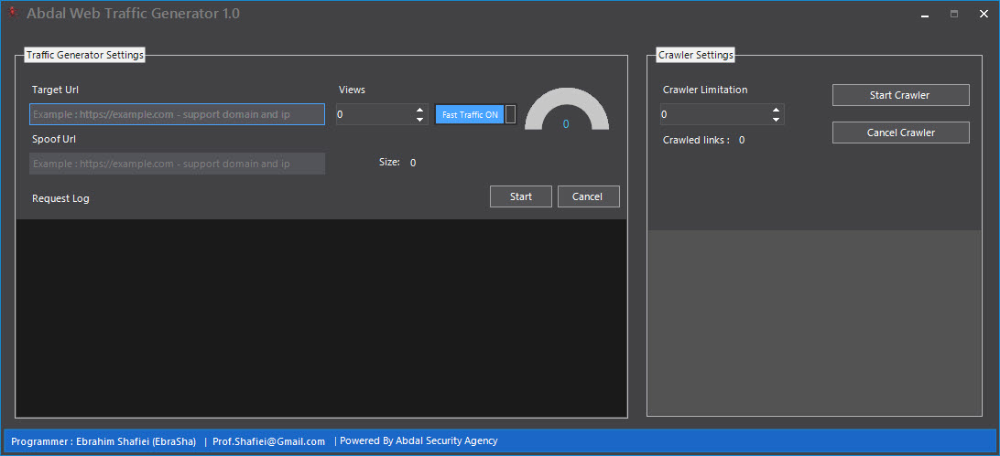

# Abdal Web Traffic Generator

## Screenshot

## Made For 

This tool will have the ability to create useful statistics and traffic on your site and actually help rank your statistics on sites like Alexa and so on.

**Requires**
> Visual Studio 2019 - Telerik WinForm - Chilkat - .NetFramework 4.*
>

Features

- Crawler Engine
- Support Spoof URL
- Views Control
- Fast Mode
- Beautiful appearance
- Has an installation package
- No malware
- Open Source
- Very high speed

## Donation 
> Donate link: https://donate.abdalagency.ir/ 

## Reporting Issues

If you are facing a configuration issue or something is not working as you expected to be, please use the **Abdal.Group@Gmail.Com** or **Prof.Shafiei@Gmail.com** . Issues on GitLab are also welcomed.

### About Programmer
Ebrahim Shafiei (EbraSha) (Ready to cooperate with international projects)
  - Email : Prof.Shafiei@Gmail.com

## License
Abdal Web Traffic Generator is open-source software licensed under the [MIT license.](https://choosealicense.com/licenses/mit/)

## ⚠️ Legal disclaimer ⚠️

Usage of Abdal Web Traffic Generator for attacking targets without prior mutual consent is illegal. It's the end user's responsibility to obey all applicable local, state and federal laws. Developers assume no liability and are not responsible for any misuse or damage caused by this program.

